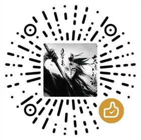

##  

### 🚀 网络加速优化
- 🕵️‍♂️ `版本检测服务`迁移至国内阿里BGP节点
- 🛡️ `系统网络检查`迁移至国内阿里BGP节点
- ⏰ `时间同步服务器`迁移至国内
- 🏫 `镜像拉取服务`迁移至南京大学节点
- 🔄 `OTA升级服务`全面迁移至国内节点
- ⚡ `系统下载地址`优化至国内高速节点
- 🐳 添加国内 [`docker.io`](https://github.com/dongyubin/DockerHub)镜像地址至系统

---

### ⚙️ 系统配置优化
- 🕰️ 默认时区设置为 `Asia/Shanghai`
- 📅 系统更新频率调整为`每月28日`定期更新
- 📢 终端页面添加`商业使用限制`声明

---

### 📦 加载项优化
- ❌ 移除不稳定的 `官方加载项源`
- ❌ 移除不稳定的 `官方社区源`
- ❌ 移除不稳定的 `Music Assistant 源`
- ❌ 移除不稳定的 `ESP Home 源`
- ✅ 添加经过全面优化与汉化的`默认加载项源`（上述移除内容均已包含在内）

---

### 🤖 智能安装体验
- 🚦 系统启动时**自动**检测网络并安装 
> 为了让更多人体验极速版，欢迎愿意共享 Token 的朋友[点击链接](https://tokenhub.hacs.vip/)共享

---

> 🚀 *专为中国用户优化加速的 Home Assistant OS*

- 🔧 保持系统原生体验，所有更改仅为提速优化以及符合中国法律。
- 🛡️ **严禁未经授权及超过10台客户端的企业商用！**
- 🛠️ 每月**27日**由 **GitHub Actions** 自动构建最新版。
- ⭐ 如果觉得有帮助，欢迎点个 Star 支持！

---

### 🚦 速度演示

- [初始化速度演示](https://www.bilibili.com/video/BV1tr7VzCE35/?share_source=copy_web&vd_source=9b5dc5e48277a13da484e0352d3707e9)  
  > 家庭宽带：1G约1~1.5分钟，500M约3分钟，100M约5分钟

- [升级速度演示](https://www.bilibili.com/video/BV1judBY2ES7?t=82.3)  
  > 升级速度与初始化类似

---

##  官方信息

- 🌐 官方网站：[https://www.hasscn.top](https://www.hasscn.top)

- 📱 官方公众号

  

---

感谢您的关注与支持！如有疑问，欢迎随时联系我。

- **黑豹x2（panther_x2）** 适配来源：[https://github.com/jianyun8023/operating-system](https://github.com/jianyun8023/operating-system)
- **Sonoff iHost** 适配来源：[https://github.com/iHost-Open-Source-Project/ha-operating-system](https://github.com/iHost-Open-Source-Project/ha-operating-system)

---

> **机型适配提交请前往：** [点击这里](https://github.com/ha-china/HAOS-CN-DEV)

---

## ☕ 如果你觉得本项目对你有帮助

- 欢迎请我喝杯咖啡~

| 微信支持 | 支付宝支持 |
|----------|------------|
|  |  |

> 名单公示在[此页面上](https://www.hasscn.top/sponsor.html#-%E7%89%B9%E5%88%AB%E9%B8%A3%E8%B0%A2)